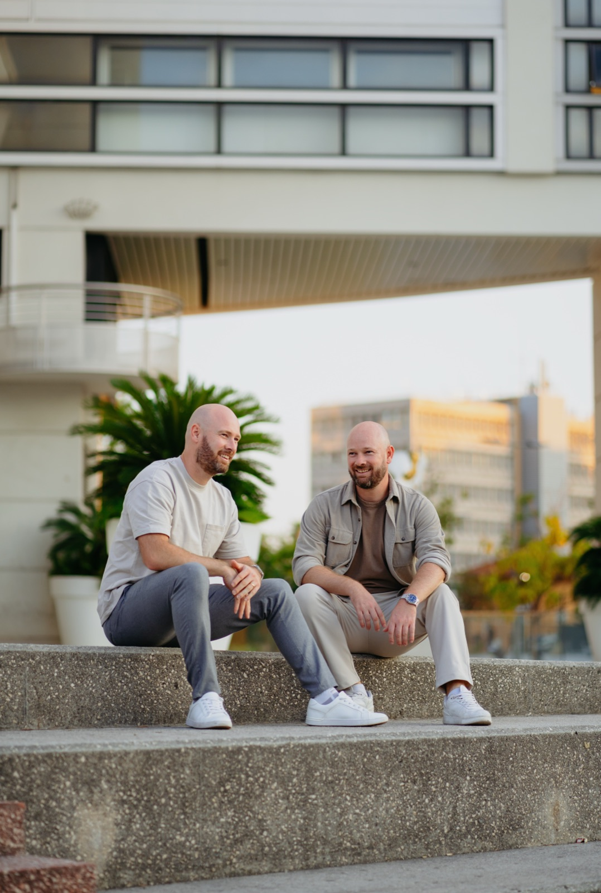

<!-- section k-fuchsia -->

## Le point de départ

J'avais une page `/articles` qui marchait. Vraiment. Hero compact en haut, barre de filtres sticky, grille de cards 3 colonnes, badge couleur par type d'article (tutos teal, opinions fuchsia, podcast orange). Compteur dynamique. Dark mode. Pas mal pour ce que c'est : une bibliothèque de 21 articles publiés.

Mais elle ressemblait à n'importe quel blog WordPress un peu propre. Or, ce site, c'est mon journal. C'est censé sentir Fiesta / 89 — la palette streetwear inspirée des Spurs de 1989. Triple-stripe teal/fuchsia/orange. Typo Archivo Black tassée à -4% de letter-spacing. Grain SVG en overlay multiply. Un truc identitaire, pas une template.

Donc le matin, je suis allé dans un canvas de design (Bolt, Lovable, peu importe — c'est l'idée qui compte), j'ai bricolé une maquette de blog en quelques prompts. Hero énorme, featured article avec ribbon « À LA UNE » qui défile, scènes CSS animées par article, filtres pills à indicateur glissant. Le résultat m'a plu. J'ai téléchargé le zip et je l'ai filé à Claude Code en disant : « Mets ce design dans la page articles. »

<div class="callout tip">
  <h4>Mon avis en 5 secondes</h4>
  <p>Faire des refontes UI à partir d'une maquette, c'est 80% de l'usage que je fais de Claude Code. Le canvas pond le visuel, Claude porte le code dans la stack du site. Sans Claude, je serais bloqué à « ouais c'est joli mais comment je le mets en HTML ».</p>
</div>

<!-- section k-teal -->

## Étape 1 — Le port React → vanilla JS (45 min)

Le zip contenait 23 fichiers : du HTML, du CSS, du JSX. La maquette utilisait React + Babel + un panel de tweaks (genre dev tool pour switcher entre layout masonry / uniform / staircase). Du React.

Sauf que mon site est en HTML/CSS/JS vanilla pur. Pas de framework. C'est volontaire — un seul fichier `articles.html` que tu ouvres et qui marche en `file://`. Pas de `node_modules`, pas de build step, pas de dépendances.

Donc j'ai dit à Claude : « Adapte ce design en vanilla JS, et garde la nav + le footer existants pour la cohérence du reste du site. »

Il a fait le port. C'est ~1100 lignes maintenant. Ce qui était React :
- `useInView` → un wrapper `IntersectionObserver` qui déclenche les animations de reveal au scroll.
- `useCountUp` → une fonction avec `requestAnimationFrame` qui fait monter le compteur de 0 à 21 en 1.4s.
- Le panel de tweaks → viré, c'est un dev tool, pas pour la prod.

Le truc malin : le design canvas avait déjà des **scènes CSS animées** par article — une pour la nuit (lune, étoiles, fenêtre, silhouette d'enfant), une pour la Chine (montagnes, soleil rouge, grille), une pour un studio podcast (micro + waveform), etc. Tout en pure CSS, zéro image bitmap. J'ai mappé chacun de mes 21 articles à une de ces 10 scènes.

Première version live en dev : le hero animait, la featured affichait l'article du fils de 4 ans (le plus récent), les filtres glissaient, la grille s'affichait en 3 colonnes. Premier screenshot dev-browser en headless : OK, ça ressemble au design.

<!-- section k-orange -->

## Étape 2 — Le bug du TL;DR qui mange la byline

Premier retour de Jeremy : « Regarde, sur les articles individuels j'ai un problème d'affichage. »

Capture d'écran : sur l'article Chine, le bloc TL;DR « En 30 secondes / Ce que tu repars avec » est en train d'écraser une petite pill blanche au-dessus, comme s'il y avait un sandwich cassé. On voit dépasser un « Jé » et un « 2026 » derrière le TL;DR.

Diagnostic en deux lignes de CSS. Le TL;DR a `margin-top: -40px` — c'est un effet voulu, le bloc remonte sur le hero dark juste au-dessus pour créer un effet de superposition élégant (avec une petite barre gradient qui dépasse en haut). Sauf que quelqu'un a inséré entre les deux une `seo-byline` (nom de l'auteur + date pour Google EEAT). Du coup le TL;DR ne remontait plus sur le hero, il remontait sur la byline. Bouillie visuelle.

15 articles touchés. La tentation : éditer 15 fichiers à la main. Mais la solution propre : **un seul sélecteur sibling** dans le CSS partagé `nav-v2.css` :

```css
.seo-byline + .container > .tldr,
.seo-byline + .tldr {
  margin-top: 16px !important;
}
```

Si une byline précède le TL;DR, on annule le négatif. Sinon, le `-40px` reste (effet préservé sur les 7 articles sans byline). Test dev-browser : `gap` entre les deux blocs = +16px. Avant c'était -16px (chevauchement). Fix chirurgical.

<div class="callout tip">
  <h4>Leçon</h4>
  <p>Quand un bug CSS affecte N fichiers similaires, demande-toi d'abord : est-ce qu'un sélecteur conditionnel (sibling, descendant, <code>:has()</code>) peut le résoudre dans un fichier partagé ? Beaucoup plus propre que 15 patches identiques.</p>
</div>

<!-- section k-fuchsia -->

## Étape 3 — La byline « Entrepreneur · pas dev · ... » qui revient sur 15 articles

Pendant qu'on était dans la byline, Jeremy m'a posé une question :

« Est-ce qu'on peut mettre autre chose que "entrepreneur, pas dev, père d'un fils de 4 ans" ? Et pourquoi pas rajouter ma photo de profil à côté de mon nom ? »

Bonne idée. La tagline actuelle changeait par article (sur Chine c'était « décrypte la géopolitique avec Claude », sur le podcast c'était autre chose) — lourd à maintenir. Et la pill « Jérémy Sagnier » avec juste un petit point fuchsia à gauche, c'était anonyme.

J'ai proposé trois options en tableau : tagline universelle vs tagline par cluster vs tagline minimaliste. Recommandation : universelle, alignée avec le pitch central de la home. *« Je teste l'IA tous les jours · Je partage ce qui m'a servi. »*

Validé. Photo aussi. Reste à faire la prod.

Pour la propagation sur 15 articles, plutôt que 15 appels Edit avec des taglines variables, j'ai écrit un mini-script Python :

```python
new_block_template = '''<!-- seo:byline -->
<div class="seo-byline" style="...">
  <a href="../index.html#story" style="...">
    
    Jérémy Sagnier
  </a>
  <span>·</span>
  <span>Je teste l'IA tous les jours · Je partage ce qui m'a servi</span>
  <span style="margin-left:auto; ...">{date}</span>
</div>
<!-- /seo:byline -->'''

for f in articles:
    if '<!-- seo:byline -->' not in f.read_text(): continue
    date_text = re.search(r'(Publié [^<]+)', text).group(1)
    new = re.sub(r'<!-- seo:byline -->.*?<!-- /seo:byline -->',
                 new_block_template.format(date=date_text),
                 text, flags=re.DOTALL)
    f.write_text(new)
```

Les marqueurs HTML commentaires `<!-- seo:byline -->` et `<!-- /seo:byline -->` rendaient le replace facile. Les dates `Publié X · MAJ Y` (15 dates différentes par article) extraites automatiquement.

15 sur 15 mis à jour en 2 secondes.

<!-- section k-teal -->

## Étape 4 — La photo qui prend 5 essais

C'est là où j'ai failli partir en vrille.

Premier essai, photo 42px ronde avec `object-position: center 25%` (cadre sur le haut de l'image). Test dev-browser : la photo est trop petite et trop basse, on voit du ciel et un crâne.

Deuxième essai, je passe à 56px et je remonte à `15%`. Test : on voit un peu mieux mais toujours bizarre.

Là, je réalise un truc en regardant la photo source : ce n'est **pas un portrait solo de Jeremy**. C'est une photo des deux frères jumeaux Sagnier (Jeremy + Kevin) assis sur des escaliers à Nice. Deux mecs barbus en chemise claire. Identiques. Comment cropper « Jeremy seul » dans une photo où il y a deux personnes ?

Troisième essai, je passe l'`` en `<span>` background-image avec `background-size: 260%` et `background-position: 60% 50%`, pour pouvoir zoomer plus que ce que `object-fit:cover` permet. Test : meilleur, mais le visage est en bas-gauche du cercle, pas centré, et on voit encore le crâne du haut de l'autre frère.

Quatrième essai, je monte le zoom à 280% et la position à 62% 42%. Test : visage à peu près au centre. Je montre à Jeremy : « Le frère de droite (chemise beige) — c'est bien toi ? » Il dit oui. Je commit. Je push.

Sauf que… Jeremy revient avec une nouvelle capture : « J'ai des problèmes d'affichage. » Les screenshots montrent l'avatar avec encore un bout de Kevin visible en bas-gauche du cercle. Plus de la grille `/articles` qui a 50% de blanc dans certaines cards (j'y reviens dans la section suivante).

Cinquième essai, et la bonne approche : **arrêter de bidouiller du CSS, pré-cropper l'image avec Python PIL**.

```python
from PIL import Image
src = Image.open('photos/A7100670.jpg')  # 1078×1600
cx, cy, half = 720, 800, 180  # centre du visage de Jeremy + rayon 180px
crop = src.crop((cx-half, cy-half, cx+half, cy+half))
crop = crop.resize((320, 320), Image.LANCZOS)
crop.save('photos/jeremy-avatar.jpg', 'JPEG', quality=88, optimize=True)
```

Trois lignes de Python. Image carrée 320×320, juste le visage de Jeremy souriant. 13 Ko. Bascule des 15 articles en ``. Plus de bidouille. Visuellement parfait.

<div class="callout warn">
  <h4>Ce que j'ai appris</h4>
  <p>Tenter de cadrer un visage avec <code>background-position</code> + <code>background-size</code> sur une photo qui contient plusieurs personnes, c'est de la pure perte de temps. Pré-cropper l'image en amont (3 lignes de Python ou un crop manuel dans Aperçu macOS) prend 10 secondes et donne un résultat parfait. <strong>Outils &gt; bidouille.</strong></p>
</div>

<!-- section k-orange -->

## Étape 5 — La grille « masonry » qui était une fausse bonne idée

Pendant la même session, l'autre bug visuel : sur la grille `/articles`, certaines cards (les `size:m`) avaient 50% de blanc en bas. Le titre + l'excerpt étaient en haut, la meta footer (date · durée · flèche) tout en bas, et entre les deux : du vide.

Le problème : le design canvas utilisait un effet **masonry**. Les cards `size:m` spannaient 2 rows verticales (plus hautes que les `size:s`), avec un `grid-auto-flow: dense` pour combler les trous. C'est super quand le contenu varie beaucoup en longueur. Mais mes excerpts font tous ~80 caractères. Donc une card sur 2 rows = card avec contenu seulement sur 1 row = trou de blanc en bas.

Solution : virer `size:m { grid-row: span 2 }` et `grid-auto-flow: dense`. Toutes les cards en uniforme. Plus de masonry.

```css
/* Avant */
.b-grid { grid-auto-flow: dense; }
.b-grid .art.size-m { grid-row: span 2; }

/* Après */
.b-grid { align-items: stretch; }
/* (suppression complète de size-m) */
```

Le design original prévoyait du masonry parce qu'il imaginait des contenus de longueurs très variées. Ma réalité : tous mes articles font à peu près la même longueur d'excerpt. **Le masonry n'avait aucun sens pour mon cas d'usage.**

<div class="callout tip">
  <h4>Leçon</h4>
  <p>Un design canvas est une <strong>maquette</strong>, pas un cahier des charges. Si une feature visuelle ne sert pas ton contenu réel, vire-la. Le canvas montre ce qui est <em>possible</em>, pas ce qui est <em>nécessaire</em>.</p>
</div>

<!-- section k-fuchsia -->

## Étape 6 — La session Claude parallèle qui me coupe l'herbe sous les pieds

À un moment dans la session, j'ai voulu commit mes changements (grid fix + avatar pré-cropé). `git status` :

```
M  articles.html
M  articles/autoresearch-karpathy.html
M  articles/hermes-agent.html
M  articles/llm-local-pour-non-dev.html
M  articles/open-source-pour-non-dev.html
A  photos/jeremy-avatar.jpg
M  sitemap.xml
```

Bizarre. Je n'avais pas touché à `autoresearch-karpathy.html`. Ni au `sitemap.xml`. Ni à `hermes-agent`. Pourquoi sont-ils modifiés ?

Diff sur l'un d'eux : juste un canonical URL fixé (`href="...../autoresearch-karpathy"` → `href="...../autoresearch-karpathy.html"`). Et `sitemap.xml` avec des nouvelles URLs ajoutées.

Conclusion : pendant que je bossais, **une autre session Claude (ou un script lancé par Jeremy) avait fait des SEO fixes en parallèle, committé et pushé**. Mes commits étaient au-dessus, mais le repo distant avait évolué entre-temps.

Pire : le commit parallèle (`9bac424`) avait déjà basculé les bylines en ``… **sans avoir poussé le fichier `jeremy-avatar.jpg` lui-même**. Donc la prod référençait une image qui n'existait pas. État cassé pendant ~20 min sans que personne ne le voie (parce que le path retournait juste un 404 silencieux et les browsers affichaient le `alt` text).

Mon ajout du fichier (le pré-crop PIL) a complété le tableau. Push. Vercel redéploie. Tout est OK.

<div class="callout warn">
  <h4>Leçon difficile</h4>
  <p>Sur un projet où plusieurs sessions ou scripts peuvent toucher au repo en parallèle, <strong>toujours <code>git fetch</code> + <code>git status</code> avant de commit/push</strong> si la session dure plus de 30 min. Et si une référence apparaît dans le code (path image, URL canonical), <strong>vérifier que la cible existe</strong>. Un avatar cassé en prod, c'est silencieux et invisible.</p>
</div>

<!-- section k-teal -->

## Le résultat

`/articles` est maintenant un vrai journal :

- **Hero énorme** avec titre split-char animé `CE QUE J'ÉCRIS / QUAND JE PENSE.` (la 2ème ligne en gradient teal→fuchsia→orange qui sweep doucement).
- **Featured** : l'article le plus récent, dans une grosse card noire, avec ribbon « À LA UNE · À LA UNE · À LA UNE » qui défile en haut, et une scène CSS animée à gauche (selon le sujet : nuit pour l'article du fils, montagnes Chine, micro studio podcast, etc.).
- **6 filtres pills** avec un indicateur glissant qui change de couleur selon la catégorie sélectionnée.
- **20 cards uniformes** dans la grille, hover 3D + glow radial, scènes CSS différentes par slug.
- **Newsletter CTA fuchsia** en bas avec marquee de fond, wired à `/api/subscribe` (Resend).
- **Byline SEO** sur chaque article avec mon avatar pré-croppé + tagline universelle.

Temps total de la session : ~3h, dont 1h pour le port React → vanilla, 30 min pour la propagation byline + tagline, 45 min pour les 5 itérations sur la photo, 15 min pour le grid fix, 30 min pour les debug git/sessions parallèles.

## Méta-leçons

**1. Un canvas de design + Claude Code = 10× ton vélo créatif.** Le canvas pond le visuel, Claude le porte dans ta stack. Sans Claude, j'aurais regardé le zip JSX et j'aurais soupiré « bon, ça je peux pas l'utiliser ». Avec Claude : « porte-moi ça en vanilla JS en gardant ma nav et mon footer ».

**2. Itère petit, valide vite.** Chaque modif visuelle = un screenshot dev-browser headless. Pas de capture = bidouiller à l'aveugle = 10 min perdues. Le `python3 -m http.server` + `dev-browser --headless` + `saveScreenshot` est mon workflow standard depuis 6 mois.

**3. Les bonnes vieilles techniques ne meurent jamais.** Pré-cropper une image avec PIL en 3 lignes de Python > 5 itérations de CSS. Un sélecteur CSS sibling > 15 patches HTML. Un script Python qui lit/regex/écrit > 15 appels Edit.

**4. La maquette n'est pas le cahier des charges.** Le masonry « avait l'air bien » sur le canvas (qui avait des contenus de longueurs variées dans la démo) mais cassait sur mon contenu réel. Toujours adapter au cas d'usage.

**5. Sur un projet partagé, le repo bouge tout seul.** Si tu as un script de SEO qui tourne, ou une autre session Claude qui patche en parallèle, ton `main` peut être devant ton local quand tu pousses. `git fetch` est ton ami.

---

*Écrit après une session de refonte le 24 avril 2026, à partir d'un canvas de design livré le matin et déployé sur jerwis.fr/articles le soir même.*
